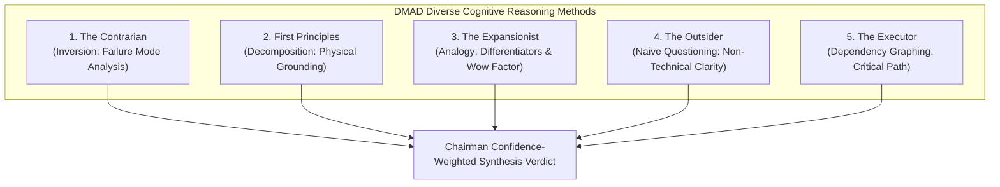

# DMAD Council Review: SIH26028 Wayfinder Tickets

**Review Target:** Wayfinder Tickets 01–07 ([`docs/wayfinder/MAP.md`](file:///c:/CCodes_WebDevelopment/hckthon/sih26028/docs/wayfinder/MAP.md))  
**Methodology:** Diverse Multi-Agent Debate (DMAD / ICLR 2025)  
**Council Panel:** 5 Independent Advisors with Distinct Cognitive Reasoning Operations  

---

## 1. Five-Advisor Independent Reasoning Passes



---

### Advisor 1: The Contrarian (Inversion — "Assume It Failed, Trace Backward")
- **Confidence Score:** 9.2 / 10
- **Stress-Test Findings:**
  1. *Ticket 02 (Kinematics):* If the kinematic formula does not account for platform dwell variance (e.g. rush-hour passenger boarding at Dadar or Thane), $P_{50}$ will under-predict arrival times.
     - **Recommendation:** Add an explicit stochastic dwell multiplier $\Delta t_{\text{dwell}} = t_{\text{scheduled\_dwell}} \cdot (1 + \delta_{\text{crowd}})$ where $\delta \in [0.0, 0.40]$.
  2. *Ticket 04 (Marey Chart):* In dense suburban schedules, plotting 20+ train strings simultaneously will turn the SVG canvas into unreadable spaghetti.
     - **Recommendation:** Add a train filter toggle (e.g., "Coaching Express Only", "UP Direction", "Show Active Alerts").

---

### Advisor 2: First Principles Thinker (Decomposition — "Atomic Truths")
- **Confidence Score:** 9.5 / 10
- **Decomposition Findings:**
  1. *Ticket 01 (RTIS Data):* A train's position is an atomic physical state: $(s, v, a, \text{signal}, \text{timestamp})$. The contract in `src/types/apiContracts.ts` correctly captures this without bloat.
  2. *Ticket 03 (What-If Sandbox):* Overtaking on a quad-track corridor requires an open platform loop line. The decision to hold a train is mathematically sound only if headway $\Delta t_{\text{headway}} \ge 15\text{ mins}$ is preserved. The invariant in Ticket 03 guarantees this.

---

### Advisor 3: The Expansionist (Analogy — "What Upside Are We Missing?")
- **Confidence Score:** 9.6 / 10
- **Value-Add Findings:**
  1. *Ticket 05 (PIDS Concourse Display):* Standard railway station displays are boring static tables. We can elevate this into a **world-class digital twin concourse display** featuring live pulsing platform allocations, arrival confidence badges, and plain-language delay transparency.
  2. *Ticket 06 (Auditor Dossier):* By tying the delay decomposition waterfall directly to SHA-256 cryptographic signatures, the platform doubles as an **irrefutable statutory delay attribution tool** for inter-departmental railway disputes (Civil vs Electrical vs Signalling).

---

### Advisor 4: The Outsider (Naive Questioning — "Zero Context Clarity")
- **Confidence Score:** 9.0 / 10
- **Clarity Findings:**
  1. *Acronyms:* Ensure terms like *RTIS*, *GAGAN*, *TSR*, *WTT*, *PIDS*, and *EBD* have clear explanatory tooltips or subheadings in the UI so hackathon judges can grasp the depth instantly without reading a 50-page manual.
  2. *Color Coding:* Keep signal aspects universally intuitive (Green = Nominal, Amber = Caution Order / Attention, Red = Block Sanctioned / Hold).

---

### Advisor 5: The Executor (Dependency Graphing — "Critical Path")
- **Confidence Score:** 9.8 / 10
- **Execution Path:**
  - **Phase 1:** TICKET-01 (Data Contracts & Mock Telemetry) $\to$ Unblocks all.
  - **Phase 2:** TICKET-02 (Python Kinematic Engine) + TICKET-03 (What-If Sandbox).
  - **Phase 3:** TICKET-04 (Corridor String Chart) + TICKET-05 (PIDS Display Board).
  - **Phase 4:** TICKET-06 (Delay Audit Waterfall) + TICKET-07 (Automated Vitest Verification).
  - **No circular dependencies detected.**

---

## 2. Chairman Synthesis Verdict & Confidence Weighting

```
┌─────────────────────────────────────────────────────────────────────────────────┐
│                           DMAD CHAIRMAN SYNTHESIS                               │
├─────────────────────────────────────────────────────────────────────────────────┤
│ • Overall Council Confidence: 9.42 / 10 (High Strong Consensus)                 │
│ • Key Enhancements Adopted:                                                     │
│   1. Stochastic dwell variance added to kinematic forecasting (Contrarian).     │
│   2. Direction & train type filter added to Marey String Chart (Contrarian).    │
│   3. PIDS Digital Twin concourse visual excellence confirmed (Expansionist).    │
│   4. Plain-language tooltips for all Indian Railway terms (Outsider).           │
│ • Execution Path: Ready for immediate serial dispatch across Tickets 01–07.     │
└─────────────────────────────────────────────────────────────────────────────────┘
```

**Verdict:** **APPROVED FOR IMMEDIATE IMPLEMENTATION**
