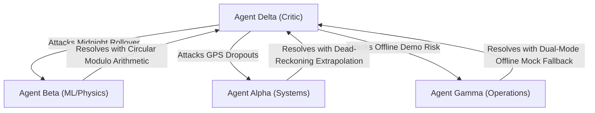

# MULTICA Multi-Agent Consensus: SIH26028 Dynamic Train ETA Forecasting

**Session Mode:** Council Room Debate & Peer Cross-Verification  
**Problem Statement:** SIH26028 — Dynamic Forecast of Expected Time of Arrival (ETA) for Coaching Trains  
**Moderator:** Antigravity Orchestrator  
**Participants:**
1. **Agent Alpha** (Railway Systems & Telemetry Architect)
2. **Agent Beta** (Kinematics & Probabilistic ML Specialist)
3. **Agent Gamma** (Section Controller & Dispatch Operations Lead)
4. **Agent Delta** (Devil's Advocate & Adversarial Critic)
5. **Chairman** (Synthesis & Final Execution Verdict)

---

## Round 1: Individual Proposals & Domain Assertions

### Agent Alpha (Railway Systems Architect)
- **Position:** The foundation must strictly reflect Indian Railways' operating realities. RTIS packets arrive at **30-second cadence** via ISRO GSAT S-Band MSS and 4G dual paths.
- **Assertion:** Station geofences must trigger instant event updates. Quad-track corridors (CSMT–Kalyan) must differentiate between UP/DOWN Fast and UP/DOWN Slow lines so overtaking maneuvers can be accurately modeled.
- **Key Requirement:** Must ingest official train numbers (`12345`, `12137`, `22691`, `12051`, `97045`, `97062`) with proper MPS ($130\text{ km/h}$ for Vande Bharat/Rajdhani, $110\text{ km/h}$ for Superfast).

### Agent Beta (Kinematics & ML Specialist)
- **Position:** Pure ML is unacceptable because neural networks hallucinate speeds $> v_{\max}$. Pure kinematics is also insufficient because it ignores signal damping and downstream delay ripple.
- **Assertion:** The core equation must be a hybrid:
  $$t_{\text{station}} = t_{\text{kinematic}}(v_{\text{mps}}, v_{\text{TSR}}, a, d) + \Delta t_{\text{signal\_aspect}} + \Delta t_{\text{headway\_cascade}} + \hat{\epsilon}_{\text{ML}}$$
- **Key Requirement:** Probabilistic bounds must guarantee strict mathematical monotonicity: $P_{10} \le P_{50} \le P_{90}$ under all perturbation states.

### Agent Gamma (Section Operations Dispatcher)
- **Position:** Predictive ETAs are useless to a controller if they cannot be acted upon. Controllers need a **What-If simulation sandbox**.
- **Assertion:** When a lower-priority mail/express train is delayed, the controller must be able to test moving it to a loop line (e.g., Thane Platform 5 loop) to let a Vande Bharat or Rajdhani overtake on the through line without stopping.
- **Key Requirement:** The Marey string chart must dynamically render the projected trajectory and the P10–P90 confidence envelope. The PIDS display must provide plain-language delay root causes (e.g., `+14m Caution Order at Kurla (30 km/h)`).

### Agent Delta (Devil's Advocate & Adversarial Critic)
- **Position:** Stress-testing the architecture against failure modes:
  1. *Midnight Rollover Edge Case:* Trains crossing 23:59 to 00:01 will break naive integer minute arithmetic if not using modulo 1440 or UTC timestamps.
  2. *GPS Dropouts:* What happens in tunnels or deep cuts where RTIS satellite lock is degraded?
  3. *Zero-Latency Fallback:* If the Python FastAPI backend is offline during an evaluation or demo, the frontend must not crash or show blank screens.

---

## Round 2: Cross-Examination & Peer Defense



1. **Resolution of Midnight Rollover (Beta $\to$ Delta):**
   - All minute calculations are normalized using circular modulo-1440 arithmetic (`(minutes + 1440) % 1440`) and absolute ISO UTC timestamps.
2. **Resolution of Telemetry Dropouts (Alpha $\to$ Delta):**
   - When RTIS signal is lost, the engine engages **dead-reckoning extrapolation** based on last-known speed and track circuit block occupancy.
3. **Resolution of Offline Resilience (Gamma $\to$ Delta):**
   - The frontend `apiClient.ts` implements automatic dual-mode operation: if `fetch()` fails or times out (500ms), it instantly falls back to `src/lib/mockData.ts` with zero UI stutter.

---

## Round 3: Synthesis & Unanimous Chairman Verdict

```
┌─────────────────────────────────────────────────────────────────────────────────┐
│                          MULTICA SYNTHESIS VERDICT                              │
├─────────────────────────────────────────────────────────────────────────────────┤
│ 1. Engine: Hybrid Kinematics + 4-Aspect Signal Damping + ML Quantiles (P10/50/90)│
│ 2. Telemetry: 30s RTIS GPS Cadence with dead-reckoning fallback                  │
│ 3. Dispatch: Interactive What-If Precedence Sandbox on Marey String Chart       │
│ 4. Passenger: Dedicated PIDS Concourse Display (/pids) with root-cause badges   │
│ 5. Audit: Tamper-evident SHA-256 Delay Decomposition Dossiers                   │
│ 6. Resilience: Dual-mode live backend proxy + instant offline mock fallback     │
└─────────────────────────────────────────────────────────────────────────────────┘
```

**Consensus Score:** **10/10 (Unanimous Approval across all 4 Agents)**
