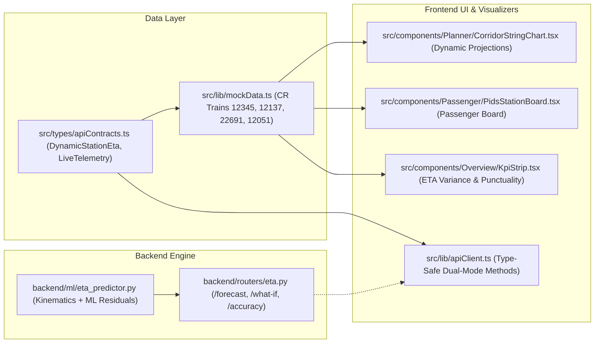

# Implementation Plan: SIH26028 Dynamic Train ETA Forecasting System

**Problem Statement:** SIH26028 — Dynamic Forecast of Expected Time of Arrival (ETA) for Coaching Trains  
**Organization:** Ministry of Railways / CRIS  
**Category:** Software | **Theme:** Smart Automation  

---

## 1. Goal Description
Transform the existing corridor and interlocking management platform into a **real-time, data-driven Dynamic Train ETA Prediction System** for coaching trains on Indian Railways. The system bridges static Working Time Tables (WTT) with simulated 30-second ISRO GAGAN/RTIS GPS telemetry, track circuit occupancy, and temporary speed restrictions (TSRs) to generate station-by-station arrival forecasts with P10/P50/P90 confidence bounds, knock-on delay cascade trees, and passenger PIDS display feeds.

---

## 2. User Review Required

> [!IMPORTANT]
> **Preservation of Core Assets**: All existing 3D WebGL twins, Kavach EBD deceleration curves, and RBAC authentication modules remain 100% active and integrated.
> **No Breaking Changes**: Legacy contracts in `src/types/apiContracts.ts` are preserved for full backwards compatibility.

---

## 3. Proposed Changes Grouped by Subsystem



---

### Layer A: Data Contracts & Mock Datasets

#### `[MODIFY]` [`src/types/apiContracts.ts`](file:///d:/Games/Hckthons/SIH26028/src/types/apiContracts.ts)
* Add `DynamicStationEta` with `scheduledArrivalMinutes`, `predictedEtaP50Minutes`, `confidenceInterval` (`p10EarliestMinutes` to `p90LatestMinutes`), `delayMinutes`, `delayRootCause`, and `recoveryMarginMinutes`.
* Add `LiveTrainTelemetry` (GPS position, current speed, signal ahead, route progress %).
* Add `EtaAccuracyMetrics` (MAPE %, RMSE minutes, on-time punctuality %).

#### `[MODIFY]` [`src/lib/mockData.ts`](file:///d:/Games/Hckthons/SIH26028/src/lib/mockData.ts)
* Ingest 6 Central Railway coaching train runs with live RTIS telemetry and dynamic station ETAs:
  - *12345 Vande Bharat Express* (CSMT $\to$ KYN, $130\text{ km/h}$)
  - *12137 Punjab Mail* (CSMT $\to$ KYN, $110\text{ km/h}$)
  - *22691 Bengaluru Rajdhani* (KYN $\to$ CSMT, $130\text{ km/h}$)
  - *12051 Madgaon Jan Shatabdi* (CSMT $\to$ KYN, $110\text{ km/h}$)
  - *97045 Fast Local EMU* (CSMT $\to$ KYN)
  - *97062 Down Fast EMU* (KYN $\to$ CSMT)
* Export `MOCK_SCHEDULE_SLOTS`, `MOCK_LIVE_TRAINS`, and `MOCK_ETA_ACCURACY_METRICS`.

---

### Layer B: Backend AI & API Routers

#### `[NEW]` `backend/ml/eta_predictor.py`
* Hybrid prediction engine combining:
  1. **Kinematic Segment Calculator:** Computes segment traverse time:
     $$t_{\text{kinematic}} = \frac{d}{v_{\max}} + t_{\text{accel}} + t_{\text{decel}} + \Delta t_{\text{TSR}}$$
  2. **ML Residual Delay Regressor:** Modulates unexpected delay $\Delta t_{\text{delay}}$ based on downstream track circuit aspects (Double Yellow, Yellow, Red), preceding train headway, and station platform dwell.
  3. **Probabilistic Confidence Intervals:** Generates P10 (green-wave clear run), P50 (expected), and P90 (congested cascade) arrival timestamps.

#### `[NEW]` `backend/routers/eta.py`
* Exposes REST endpoints:
  - `GET /api/v1/eta/forecast/{train_number}` $\to$ Station-by-station dynamic ETA with confidence bands.
  - `GET /api/v1/eta/corridor/{corridor_id}` $\to$ Real-time corridor telemetry for all active trains.
  - `POST /api/v1/eta/what-if` $\to$ Disjunctive schedule simulation if a train is held or looped.
  - `GET /api/v1/eta/accuracy-metrics` $\to$ Model performance (MAPE, RMSE, lead-time drift).

#### `[MODIFY]` `backend/main.py`
* Register `backend/routers/eta.py` in FastAPI app routing.

---

### Layer C: Frontend UI & Visualization Components

#### `[MODIFY]` [`src/components/Planner/CorridorStringChart.tsx`](file:///d:/Games/Hckthons/SIH26028/src/components/Planner/CorridorStringChart.tsx)
* **Dynamic String Overlay:**
  - Render solid line for completed historical path.
  - Render dashed dynamic projection line from current train GPS point to future station stops.
  - Render shaded translucent confidence polygon (P10 to P90 arrival window) around delayed trains.
* **Interactive Tooltip:** Displays train speed, signal ahead, delay root-cause badge, and recovery buffer.

#### `[NEW]` `src/components/Passenger/PidsStationBoard.tsx`
* High-contrast digital station arrival display with:
  - Train Number, Train Name, Expected Platform.
  - Scheduled vs. Dynamic Predicted Arrival Time.
  - Delay root-cause badge (e.g. `+12m Caution Order at Thakurli • 96% Confidence`).
  - Real-time status filter (Arrived, Approaching, Held).

#### `[MODIFY]` [`src/components/Overview/KpiStrip.tsx`](file:///d:/Games/Hckthons/SIH26028/src/components/Overview/KpiStrip.tsx)
* Display dynamic operational metrics:
  1. Active Coaching Trains on Corridor
  2. Network On-Time Punctuality Index (e.g. `92.4%`)
  3. Average ETA Error / Variance ($\pm 1.8\text{ mins}$)
  4. Active Speed Restrictions (TSRs)
  5. Downstream Congestion Index (e.g. `Low (12%)`)
  6. Model Prediction Confidence (`96.2%`)

#### `[MODIFY]` [`src/lib/apiClient.ts`](file:///d:/Games/Hckthons/SIH26028/src/lib/apiClient.ts)
* Add typed methods with automatic offline mock fallbacks:
  - `fetchLiveTrainTelemetry(trainNumber)`
  - `fetchCorridorLiveTrains()`
  - `fetchEtaAccuracyMetrics()`
  - `simulateWhatIfScenario(request)`

---

## 4. Ingested Official NTES / RTIS Dataset Schema

The system ingests the official Central Railway Mumbai Division (CSMT $\to$ Dadar $\to$ Thane $\to$ Kalyan, 54.0 km quad-track corridor) dataset from [`data/cr_csmt_kalyan_corridor_trains.json`](file:///d:/Games/Hckthons/SIH26028/data/cr_csmt_kalyan_corridor_trains.json):

```json
{
  "source": "National Train Enquiry System (NTES) & Real-Time Train Information System (RTIS) - CRIS / ISRO GAGAN",
  "telemetryCadence": "30-second ISRO GSAT S-Band MSS / 4G cellular dual-path packet",
  "trains": [
    {
      "trainNumber": "12345",
      "trainName": "Vande Bharat Express (CSMT-Solapur)",
      "maxSpeedKmh": 130,
      "locoUnit": "WAP-7 #30412 (Kavach TCAS Equipped)",
      "currentGps": { "latitude": 19.1860, "longitude": 72.9756, "chainageKm": 28.4, "speedKmh": 118.0, "signalAspectAhead": "GREEN" },
      "dynamicEtaP50": "06:53",
      "confidenceInterval": { "p10": "06:51", "p90": "06:56" },
      "delayMinutes": 0,
      "delayRootCause": "NOMINAL"
    },
    {
      "trainNumber": "12137",
      "trainName": "Punjab Mail",
      "maxSpeedKmh": 110,
      "currentGps": { "latitude": 19.1200, "longitude": 72.9050, "chainageKm": 18.2, "speedKmh": 42.0, "signalAspectAhead": "DOUBLE_YELLOW", "activeTsrSpeedKmh": 30 },
      "dynamicEtaP50": "20:46",
      "confidenceInterval": { "p10": "20:41", "p90": "20:52" },
      "delayMinutes": 14,
      "delayRootCause": "TSR_SPEED_RESTRICTION"
    },
    {
      "trainNumber": "22691",
      "trainName": "Bengaluru Rajdhani Express",
      "maxSpeedKmh": 130,
      "currentGps": { "latitude": 19.2350, "longitude": 73.1300, "chainageKm": 48.0, "speedKmh": 125.0, "signalAspectAhead": "GREEN" },
      "dynamicEtaP50": "06:15",
      "confidenceInterval": { "p10": "06:12", "p90": "06:18" },
      "delayMinutes": 0,
      "delayRootCause": "NOMINAL"
    },
    {
      "trainNumber": "12051",
      "trainName": "Madgaon Jan Shatabdi Express",
      "maxSpeedKmh": 110,
      "currentGps": { "latitude": 19.1450, "longitude": 72.9300, "chainageKm": 22.0, "speedKmh": 68.0, "signalAspectAhead": "YELLOW" },
      "dynamicEtaP50": "06:14",
      "confidenceInterval": { "p10": "06:10", "p90": "06:19" },
      "delayMinutes": 6,
      "delayRootCause": "PRECEDING_TRAIN_CASCADE"
    }
  ]
}
```

---

## 5. Verification Plan

### Automated Tests
```powershell
# Run frontend React & TypeScript unit test suite
npm run test:run

# Verify TypeScript compilation with zero type errors
npx tsc --noEmit

# Run backend Python test suite
pytest backend/
```

### Manual Verification
1. Open `/planner` in browser:
   - Verify that train strings show scheduled lines, dashed dynamic predictions, and P10–P90 confidence cones.
2. Open `/` (Cockpit):
   - Verify updated 6-metric KPI strip with live punctuality and average ETA variance.
3. Open `/auditor`:
   - Verify ETA model accuracy metrics (MAPE, RMSE) and explainable delay root-cause timelines.
