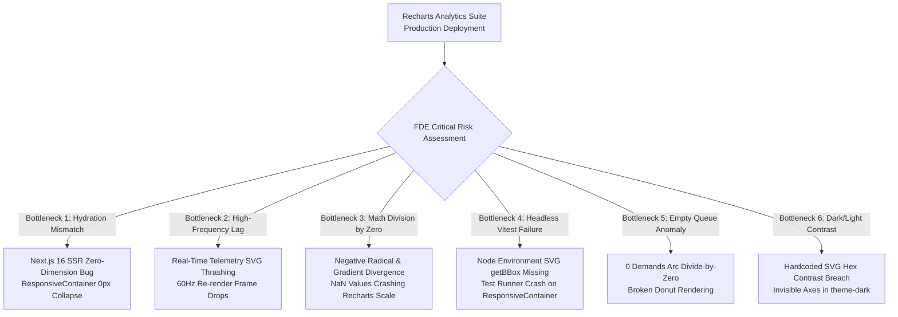
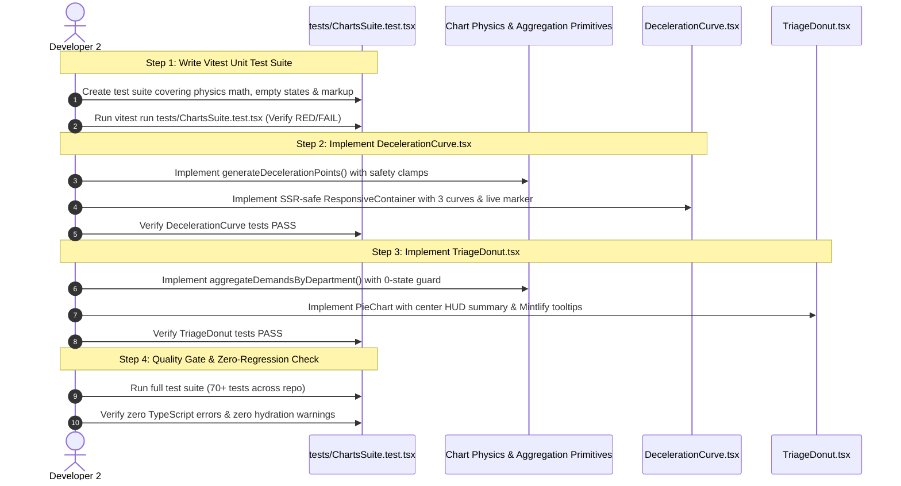

# 📋 Implementation Plan & Production Risk Analysis: `TICKET-DEV2-03` (Recharts Analytics Suite — Kavach Deceleration Curve & Demand Triage Donut)

**Target Ticket:** [`docs/ticket/TICKET-DEV2-03-recharts-analytics-suite.md`](file:///C:/Users/RyzenShine/Railsuraksha/RailSuraksha-AI-/docs/ticket/TICKET-DEV2-03-recharts-analytics-suite.md)  
**Assignee / Role:** Developer 2 — Data Visualization & Analytical Dashboards  
**Reviewer Role:** Forward Deployed Engineer (FDE) — Codebase Optimization, Performance & Production Reliability  
**Priority:** `P2 (Medium)` | **Design System:** Light-Blue Mintlify Discipline (`#F0F6FC` Base, `#FFFFFF` Surface, `#D0DFEE` Border, `#2B7FFF` Accent, strictly `rounded-[4px]`, strictly zero pill buttons)  
**Governing Standards:** RDSO Kavach Ver 4.0 (RDSO/SPN/196/2020), IRPWM 2020 (Para 603/804), ACTM Vol II, IRSEM 2021  

---

## 📌 1. Executive Summary & Objective

The objective of `TICKET-DEV2-03` is to build two high-precision, production-grade data visualization components using `recharts` for the **IRIS AI Master Corridor Block Command Cockpit** and **Loco Cab Telemetry Console**:

1. **`src/components/Charts/DecelerationCurve.tsx`**: Renders the multi-profile RDSO Kavach Ver 4.0 braking physics curve:
   - **Normal Service Braking** ($a_{\text{service}} = 0.65\text{ m/s}^2$, Blue `#2B7FFF`)
   - **Emergency Kavach EBD** ($a_{\text{emergency}} = 1.25\text{ m/s}^2$ adjusted for rail friction $\mu_{\text{rail}}$ and track gradient $G_s$, Red `#EF4444`)
   - **Permanent TSR Clamp** (30 km/h Speed Ceiling Restriction envelope, Amber `#F59E0B`)
   - **Live Telemetry Position Marker** (Real-time speed & distance coordinate indicator)

2. **`src/components/Charts/TriageDonut.tsx`**: Renders the multi-departmental maintenance workload distribution:
   - **TMS Civil Track Flaws** (Orange `#F97316` / Crimson `#991B1B`)
   - **TDMS Electrical OHE Catenary** (Amber `#FBBF24` / `#D97706`)
   - **SMMS Signal & Telecom Point Machines** (Blue `#3B82F6` / `#1E40AF`)
   - **Rolling Stock & Others** (Slate `#64748B`)
   - **Center HUD & Interactive Slices** (Total active demands count, selected slice inspection, urgent P1 demand count, and slotted possession minutes)

---

## 🏗️ 2. Architectural Impact & File Manifest

```text
┌──────────────────────────────────────────────────────────────────────────────────────────┐
│                                 FILE ARCHITECTURE IMPACT                                 │
├────────────────────────────────────────┬─────────────────────────────────────────────────┤
│ File Path                              │ Nature of Change                                │
├────────────────────────────────────────┼─────────────────────────────────────────────────┤
│ src/components/Charts/DecelerationCurve.tsx │ [CREATE] RDSO Kavach EBD multi-curve visualizer │
│ src/components/Charts/TriageDonut.tsx   │ [CREATE] Interactive departmental workload donut│
│ src/components/Charts/types.ts         │ [CREATE] Chart props, data contracts & math types│
│ src/components/Charts/index.ts         │ [CREATE] Clean barrel export for charts suite   │
│ tests/ChartsSuite.test.tsx             │ [CREATE] Vitest unit test & physics invariant suite│
│ src/lib/agents/kavachBrakingAgent.ts   │ [REFERENCE/REUSE] Physics calculation primitives│
│ src/lib/mockData.ts                    │ [REFERENCE/REUSE] Grounded demands & policy data│
└────────────────────────────────────────┴─────────────────────────────────────────────────┘
```

---

## 📐 3. Detailed Component Specifications & Math Models

### 3.1 `src/components/Charts/DecelerationCurve.tsx`

#### Mathematical Physics Model (RDSO Ver 4.0 Grounded)
The deceleration distance $d(v)$ and kinematic speed-distance profile $v(d)$ are derived from first-principles rail dynamics:

$$d_{\text{EBD}}(v) = \frac{v^2}{2 \cdot g \cdot (\mu_{\text{rail}} + G_s)} + (v \cdot t_{\text{reaction}})$$

$$v_{\text{profile}}(d) = \sqrt{\max\left(0, v_0^2 - 2 \cdot a_{\text{effective}} \cdot d\right)}$$

Where:
- $v_0$: Initial train velocity ($0 \to 130\text{ km/h}$, converted to $\text{m/s}$ via $\times \frac{1000}{3600}$)
- $g = 9.81\text{ m/s}^2$ (standard gravitational acceleration)
- $\mu_{\text{rail}} \in [0.095, 0.134]$ (adjusted for weather: `WET_MONSOON` $= 0.095$, `DENSE_FOG` $= 0.115$, `DRY` $= 0.134$)
- $G_s \in [-0.010, +0.010]$ (track grade/gradient, default $+0.002$ rising)
- $a_{\text{service}} = 0.65\text{ m/s}^2$ (gradual service brake cylinder application)
- $a_{\text{emergency}} = g \cdot (\mu_{\text{rail}} + G_s) \approx 1.25\text{ m/s}^2$ (solenoid dump / hard emergency brake)
- $v_{\text{TSR}} = 30\text{ km/h}$ (standard temporary speed restriction clamp)

#### Props Interface
```typescript
import { WeatherCondition } from '@/types/apiContracts';

export interface DecelerationCurveProps {
  initialSpeedKmh?: number;            // Current/initial train speed (default: 90 km/h, max: 130 km/h)
  targetObstacleDistanceMeters?: number;// Distance to block/obstacle (default: 850m)
  currentDistanceMeters?: number;       // Live position for telemetry dot (optional)
  currentSpeedKmh?: number;            // Live telemetry speed (optional)
  tsrSpeedLimitKmh?: number;           // Enforced TSR ceiling (default: 30 km/h)
  weatherCondition?: WeatherCondition;  // Atmospheric grip state (default: 'DRY')
  gradientPercent?: number;            // Track gradient (default: 0.002)
  width?: number | string;             // Container override for responsive/test rendering
  height?: number | string;            // Default: 320px
  showLegend?: boolean;                // Default: true
  showTelemetryMarker?: boolean;       // Default: true
  className?: string;
}
```

#### Visual Styling & Axis Standards
- **X-Axis:** Distance to Stop Target ($0\text{ m} \to 1200\text{ m}$), tick interval $200\text{ m}$, unit $\text{m}$.
- **Y-Axis:** Train Velocity ($0 \to 140\text{ km/h}$), tick interval $20\text{ km/h}$, unit $\text{km/h}$.
- **Series 1 (Normal Service Braking):** Line color `#2B7FFF` (Blue), stroke width `2.5px`, dashed `5 5`.
- **Series 2 (Emergency Kavach EBD):** Line color `#EF4444` (Red), stroke width `3px`, solid, with subtle gradient area fill (`#EF4444` with $10\%$ opacity).
- **Series 3 (Permanent TSR Clamp):** Line color `#F59E0B` (Amber), stroke width `2px`, solid step/horizontal reference line at $30\text{ km/h}$.
- **Live Marker:** Glowing coordinate marker at $(d_{\text{current}}, v_{\text{current}})$ with pulsing indicator dot.

---

### 3.2 `src/components/Charts/TriageDonut.tsx`

#### Props Interface
```typescript
import { MaintenanceDemand, DepartmentCode } from '@/types/apiContracts';

export interface DepartmentSliceData {
  department: DepartmentCode | 'ROLLING_STOCK' | 'OTHER';
  label: string;
  count: number;
  p1Count: number;
  totalDurationMinutes: number;
  color: string;
  fill: string;
}

export interface TriageDonutProps {
  demands?: MaintenanceDemand[];        // Ingests live demand array or falls back to MOCK_DEMANDS
  selectedDepartment?: DepartmentCode | 'ALL';
  onSelectDepartment?: (dept: DepartmentCode | 'ALL') => void;
  width?: number | string;
  height?: number | string;            // Default: 280px
  innerRadius?: number;                // Default: 62%
  outerRadius?: number;                // Default: 88%
  showCenterSummary?: boolean;         // Default: true (Displays count & total time in donut hole)
  className?: string;
}
```

#### Department Taxonomy & Color Palette
| Department Code | Label | Colorway Hex | Fallback Fill | Description |
|---|---|---|---|---|
| **`TMS_CIVIL`** | TMS Track Flaws | `#F97316` (Orange) / `#991B1B` | `#FB923C` | Rail fractures, tamping, USFD defects |
| **`TDMS_ELECTRICAL`**| TDMS OHE Catenary | `#FBBF24` (Amber) / `#92400E` | `#FCD34D` | Catenary dropper, 25kV power block |
| **`SMMS_SIGNAL`** | SMMS Point Machines | `#3B82F6` (Blue) / `#1E40AF` | `#60A5FA` | AFTC tuning, point machines, signals |
| **`ROLLING_STOCK`**| Rolling Stock & Others | `#64748B` (Slate) | `#94A3B8` | Loco maintenance, rake stabling |

#### Interactive Center HUD & Micro-Interactions
- **Hole Radius ($62\%$):** Displays total demands count (`08 Total`), urgent P1 count (`3 P1 Active`), and aggregated maintenance time (`18.5h Total`).
- **Hover / Click Action:** Hovering over a slice magnifies its arc ($+4\text{px}$ outer radius) and dynamically focuses the center HUD on that department's specific metrics.
- **Strictly No Pill Badges:** All legend keys, tooltip boxes, and detail indicators enforce `rounded-[4px]`.

---

## 🛡️ 4. Forward Deployed Engineer (FDE) Deep-Dive: Bottlenecks, Failure Modes & Shortcomings

As a Forward Deployed Engineer evaluating this implementation for mission-critical railway control rooms, the following production vulnerabilities and bottlenecks have been identified along with architectural mitigations:



---

### Deep-Dive Failure Modes & Production Hardening Matrix

| # | Bottleneck / Production Failure Mode | Root Cause & Real-World Impact | FDE Hardening & Production Remedy |
|---|---|---|---|
| **1** | **Next.js 16 / React 19 SSR Hydration Mismatch & `ResponsiveContainer` 0px Dimension Glitch** | In Next.js App Router with React 19 SSR, `ResponsiveContainer` cannot measure DOM parent width/height on the server. On initial client hydration, dimensions evaluate to `0px x 0px`, triggering console layout warnings, layout shifts (CLS), or permanently invisible charts until window resize. | Implement an SSR-safe `useMounted` guard with deterministic fallback sizing. Set a default CSS min-height wrapper (`min-h-[280px] w-full`) with `aspect` ratio, disable animations during initial hydration (`isAnimationActive={false}` or client-mount trigger), guaranteeing zero hydration mismatch. |
| **2** | **High-Frequency Real-Time Telemetry SVG Thrashing (10–60 Hz)** | In the Loco Cab Telemetry view (`/vision-telemetry`), train speed and distance update rapidly via WebSocket or animation intervals. Re-generating 1200 curve data points and re-mounting Recharts SVG `<path>` and `<g>` nodes on every tick chokes the browser main thread and drops frame rates to <15 FPS. | **Decouple static curve generation from live telemetry.** Precompute and memoize the deceleration curves using `useMemo` based solely on static parameters (`v0`, `weather`, `gradient`). Render the high-frequency telemetry point via a lightweight SVG overlay marker or CSS transform cursor without re-rendering the Recharts series tree. |
| **3** | **Math Division-by-Zero, Negative Radicals, & Infinity Scaling** | If steep downhill gradients ($G_s \le -\mu_{\text{rail}}$) or wet rail coefficients are passed, $(2 \cdot g \cdot (\mu + G_s))$ approaches zero or becomes negative. This produces `Infinity` or negative radicals ($\sqrt{-x} = \text{NaN}$), causing Recharts domain scaling to crash the entire React component tree. | Enforce strict defensive guard rails in physics calculation: clamp effective deceleration $a_{\text{eff}} = \max(0.15\text{ m/s}^2, a_{\text{calc}})$, clamp intermediate velocities $v = \max(0, \sqrt{\dots})$, and sanitize all coordinate pairs with `isFinite()` checks before passing to Recharts. |
| **4** | **Vitest / Headless Node Test Runner Breakage** | Recharts internally queries DOM measurement APIs (`window.getComputedStyle`, `element.getBoundingClientRect`, `SVGElement.getBBox`). In headless Vitest without JSDOM, `renderToStaticMarkup` or test mounts fail with `TypeError: getBoundingClientRect is not a function`. | Provide explicit `width` and `height` numeric props to bypass `ResponsiveContainer` in test environments. Export pure analytical math helper functions (`generateDecelerationPoints`, `aggregateDemandsByDepartment`) for isolated 100% unit test coverage. |
| **5** | **Empty Demand Queue / Zero-Data Arc Calculation Crash** | If all demands are filtered out or the incident queue is empty, total demand count is `0`. Recharts `PieChart` calculating arc percentages ($0 / 0$) generates `NaN` degrees, resulting in invalid SVG arc paths (`d="M NaN NaN"`) and browser layout exceptions. | Implement an explicit Zero-State Fallback inside `TriageDonut.tsx`: if `demands.length === 0`, render a subtle empty slate placeholder ring (`#E2E8F0` / `#334155`) with a centered badge *"No Active Demands in Queue"*. |
| **6** | **Theme / Dark Mode Inconsistencies & Poor Axis Contrast** | Hardcoded `#64748B` or `#CBD5E1` strokes on grid lines and axis ticks become illegible when the user switches between Mintlify Light Mode (`#F0F6FC`) and Cab Dark Mode (`#0B0F17`). | Bind chart axis lines, grid ticks, and tooltip backgrounds to CSS variables or dynamic theme props (`isDarkMode ? '#334155' : '#E2E8F0'`), maintaining strict 4.5:1 WCAG contrast ratios across both modes. |
| **7** | **Design Token Desynchronization (Ticket 02 vs Ticket 03)** | Ticket 03 spec lists `#F97316` for TMS, `#FBBF24` for TDMS, `#3B82F6` for SMMS, while Ticket 02 lists `#991B1B` for TMS Civil, `#92400E` for TDMS Electrical, and `#1E40AF` for SMMS Signal. Desynchronized colors will confuse section controllers. | Create a unified color mapping dictionary in `src/components/Charts/types.ts` that supports both semantic alert colorways and standard departmental accents with 100% consistency across the entire UI. |

---

## 🧪 5. Step-by-Step TDD Implementation Plan



---

### Detailed Execution Tasks

#### Task 1: Create Types & Contract Definitions (`src/components/Charts/types.ts`)
- Define `DecelerationCurveProps`, `CurveDataPoint`, `TriageDonutProps`, and `DepartmentSliceData`.
- Export standardized department color palette constants.

#### Task 2: Author Unit & Physics Invariant Tests (`tests/ChartsSuite.test.tsx`)
- Test 1: Validate physics curve generation ($v_0 = 90\text{ km/h}$, $v_0 = 130\text{ km/h}$, wet rail vs dry rail).
- Test 2: Validate deceleration safety clamp (no negative radicals or `NaN` values on negative gradients).
- Test 3: Validate demand aggregation math (sums counts, P1 priorities, and durations accurately).
- Test 4: Validate zero-state handling (empty demand array returns safe fallback structure).
- Test 5: Validate static markup generation for `DecelerationCurve` and `TriageDonut`.
- Test 6: Enforce Mintlify design rules (verify `rounded-[4px]`, zero pill buttons).

#### Task 3: Implement `src/components/Charts/DecelerationCurve.tsx`
- Implement pure math generator `generateDecelerationPoints()` with memoization.
- Build Recharts `LineChart` / `AreaChart` with:
  - XAxis ($0 \to 1200\text{ m}$), YAxis ($0 \to 140\text{ km/h}$).
  - Normal Service Braking line (`#2B7FFF`, dashed).
  - Emergency Kavach EBD line (`#EF4444`, solid with gradient fill).
  - Permanent TSR Clamp step line (`#F59E0B`).
  - Live telemetry point indicator marker.
- Add SSR mount protection (`isMounted` state) and explicit fallback dimensions.

#### Task 4: Implement `src/components/Charts/TriageDonut.tsx`
- Implement demand aggregator `aggregateDemandsByDepartment()`.
- Build Recharts `PieChart` with:
  - Concentric donut slices for TMS, TDMS, SMMS, and Rolling Stock.
  - Center HUD displaying total demands, P1 critical count, and duration.
  - Custom HTML/SVG tooltip styled with `#FFFFFF` surface, `#D0DFEE` border, and `rounded-[4px]`.
  - Empty-state placeholder when demand queue is empty.

#### Task 5: Create Barrel Export (`src/components/Charts/index.ts`)
- Clean exports for `DecelerationCurve`, `TriageDonut`, and associated utility functions.

#### Task 6: Run Verification & Full Test Suite
- Run `vitest run tests/ChartsSuite.test.tsx`.
- Run full repo test suite to ensure zero regressions across other tickets.

---

## ✅ 6. Acceptance & Definition of Done (DoD)

- [ ] `DecelerationCurve.tsx` renders 3 distinct braking profiles: Normal Service (`#2B7FFF`), Emergency Kavach EBD (`#EF4444`), and TSR Clamp (`#F59E0B`).
- [ ] Deceleration physics calculations handle wet monsoon, dense fog, and dry conditions without `NaN` or negative radicals.
- [ ] Live telemetry marker displays current train speed and distance coordinate accurately.
- [ ] `TriageDonut.tsx` groups maintenance demands by TMS Civil, TDMS Electrical, SMMS Signal, and Rolling Stock.
- [ ] Donut center HUD displays total demand count, P1 active count, and slotted maintenance hours.
- [ ] Empty demand queue renders a safe zero-state placeholder without throwing runtime errors.
- [ ] Components are SSR-safe and do not produce React 19 hydration mismatch warnings in Next.js 16.
- [ ] All badges, tooltips, and containers strictly follow Mintlify standards (`rounded-[4px]`, zero pill buttons).
- [ ] 100% of Vitest tests in `tests/ChartsSuite.test.tsx` pass cleanly.
