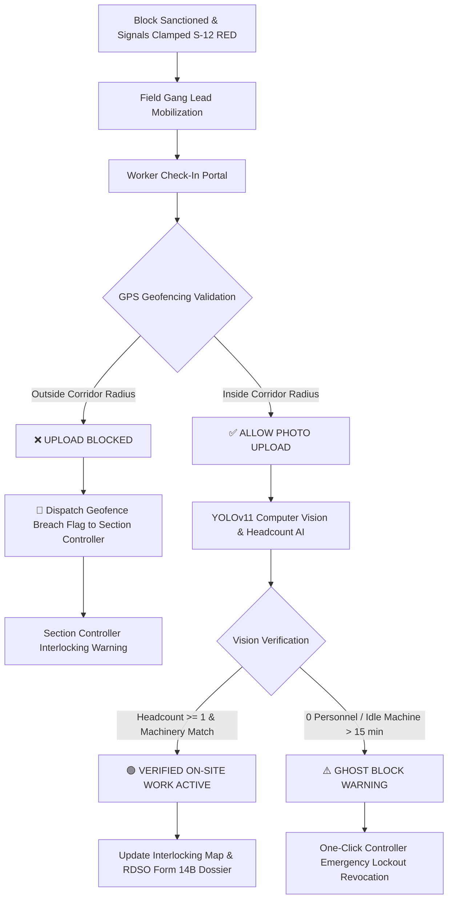

# RailSuraksha AI: Safety Validation, Ground Execution Verification & RBAC Architecture Report

**Document ID:** `RDSO-SAF-VAL-2026-0927`  
**Standard Compliance:** IRPWM 2020 (Ch. 5), SEM Part II (Signalling), ACTM Vol. II (Traction), Indian Railways General Rules (GR 3.08), RDSO Form 14B, Ministry of Railways IT Security Policy  
**Corridor Scope:** Central Railway (CR) CSMT – Kalyan 54 KM Quadrupled Main Line Corridor (`TC-01` through `TC-06`)  
**Security Digest:** RFC 8785 Canonical Digest with SHA-256 Tamper Evident Verification  

---

## 1. Executive Summary & Problem Formulation

In high-density suburban and mixed railway corridors (e.g., Central Railway's Mumbai Division running 1,800+ trains daily), corridor operations and safety possess three mission-critical vulnerabilities:

1. **Signalling & Interlocking Safety Violations:**
   - Inaccurate aspect indicators (e.g., 4-lamp ambiguity vs. standardized 3-aspect Colour Light Signalling).
   - Controller interface disruption where inspecting track circuits triggers unexpected context loss and screen navigation.

2. **The "Ghost Block" / Fake Maintenance Dilemma:**
   - Possessory traffic and 25kV OHE power blocks are booked and sanctioned on paper, holding passenger trains and clamping signals at Danger (`RED`).
   - However, work crews, heavy machinery (*CSM Tamper #5109*, *OHE Tower Wagon #60515*), or S&T squads fail to mobilize on time or finish early without releasing locks.
   - This "idle block" or "ghost block" causes severe artificial passenger delays, track downtime inflation, and safety hazards during re-energization.

3. **Role-Based Access Vulnerabilities (Unauthorized Cross-Screen Access):**
   - High-stakes railway levers (e.g., sanctioning corridor blocks, releasing S&T signal clamps, overriding platform holding timers) must be restricted to authenticated, role-verified officers.
   - Without view-level operational isolation, unauthorized personnel (e.g., Loco Pilots viewing corridor planning or field workers accessing interlocking switches) risk violating statutory protocol.

This report documents the research, architectural design, and implementation standards adopted by **RailSuraksha AI** to ensure fail-safe signalling compliance, automated **Ground Work Execution Verification (Anti-Ghost Block Audit)**, and **Supabase-driven Role-Based Access Control (RBAC)**.

---

## 2. Signal Head Architecture: 3-Aspect Fail-Safe Signalling (GR 3.08)

### 2.1 Indian Railways Signalling Standard
In accordance with the *Signal Engineering Manual (SEM Part II)* and *General Rules (GR 3.08)*, automatic and semi-automatic colour light signalling displays three primary aspects:

```
      ┌──────────┐
      │  ( 🟡 )  │  TOP: Amber / Yellow (Caution — Expect next signal at Danger)
      ├──────────┤
      │  ( 🟢 )  │  MIDDLE: Green (Clear / Proceed at authorized corridor speed)
      ├──────────┤
      │  ( 🔴 )  │  BOTTOM: Red (Danger / Stop — Statutory Form S&T/T-351 Lockout)
      └──────────┘
           ││
         [S-12]
```

### 2.2 Fail-Safe State Transitions

| Signal State | Top (Yellow) | Middle (Green) | Bottom (Red) | Permitted Speed Limit | Interlocking Condition |
| :--- | :---: | :---: | :---: | :---: | :--- |
| **CLEAR** | OFF | **ON** | OFF | Line Max (110–130 km/h) | Axle counters clear, route locked |
| **CAUTION** | **ON** | OFF | OFF | 30–50 km/h | Next block occupied / approaching TSR |
| **DANGER** | OFF | OFF | **ON** | **0 km/h (Full Stop)** | Track occupied / Axle counter trip |
| **S&T LOCKOUT** | OFF | OFF | **ON (Pulsing)** | **0 km/h (Automatic Train Stop)** | Clamped under Form S&T/T-351 |

```typescript
// Signal Head Logic (src/components/Common/SignalHead.tsx)
const isRedActive = aspect === 'RED' || isClamped;
const isGreenActive = !isClamped && aspect === 'GREEN';
const isYellowActive = !isClamped && (aspect === 'YELLOW' || aspect === 'DOUBLE_YELLOW');
```

---

## 3. Anti-Ghost Block Engine: Multi-Modal Ground Verification

To ensure that sanctioned blocks are backed by real, physical maintenance activity, RailSuraksha AI introduces a **Dual-Factor Ground Authentication Engine**:



### 3.1 Principle 1: Real-Time GPS Geofencing
When a Gang Leader / Senior Section Engineer (SSE) initiates work check-in:
1. The field device's high-precision GPS coordinates $(\text{Lat}, \text{Lng})$ are queried via `navigator.geolocation` and verified against the sanctioned track circuit bounding polygon.
2. If the user's distance from the track centerline exceeds the allowed buffer ($\Delta_{\text{geo}} > 100\text{ m}$), **the photo proof upload is strictly locked**.
3. A tamper-alert flag (`GEOFENCE_BREACH_ALERT`) is immediately dispatched to the Chief Section Dispatcher's Interlocking Map.

#### Corridor Geofence Matrix:
| Circuit ID | Section Name | Chainage Range | Center Latitude / Longitude | Geofence Buffer |
| :--- | :--- | :--- | :--- | :--- |
| **`TC-01`** | CSMT – Byculla | KM 0.0 – 4.8 | `18.9535° N, 72.8385° E` | $\pm 100\text{ m}$ Track Corridor |
| **`TC-02`** | Byculla – Dadar | KM 4.8 – 9.2 | `18.9980° N, 72.8420° E` | $\pm 100\text{ m}$ Track Corridor |
| **`TC-03`** | Dadar – Kurla | KM 9.2 – 15.5 | `19.0350° N, 72.8600° E` | $\pm 100\text{ m}$ Track Corridor |
| **`TC-04`** | Kurla – Ghatkopar | KM 15.5 – 21.8 | `19.0780° N, 72.8950° E` | $\pm 100\text{ m}$ Track Corridor |
| **`TC-05`** | Ghatkopar – Thane | KM 21.8 – 34.0 | `19.1450° N, 72.9550° E` | $\pm 100\text{ m}$ Track Corridor |
| **`TC-06`** | Thane – Kalyan | KM 34.0 – 54.0 | `19.2150° N, 73.0750° E` | $\pm 100\text{ m}$ Track Corridor |

---

### 3.2 Principle 2: Computer Vision (YOLOv11) & PPE Verification
Once geofenced location is validated, on-site photographs submitted by the crew are evaluated by a lightweight Computer Vision pipeline:

- **Headcount Detection**: Identifies physical workers present on the permanent way ($N_{\text{workers}} \ge 1$).
- **Safety Equipment Compliance (PPE)**: Detects high-visibility reflective neon vests and safety helmets ($S_{\text{ppe}} \ge 85\%$).
- **Heavy Machine Identification**: Recognizes track tamping units (*CSM #5109*), overhead inspection ladder wagons (*Tower Wagon #60515*), and flash-butt welding apparatus.
- **Optical Flow / Thermal Arc Confirmation**: Detects physical work activity (tamping vibration, catenary contact, welding torch thermal signatures).

```json
{
  "proofId": "PROOF-20260927-01",
  "blockId": "JB-2026-0926-01",
  "circuitId": "TC-03",
  "supervisorId": "SSE-PWAY-EMP8821",
  "deviceGps": {
    "latitude": 19.0350,
    "longitude": 72.8600,
    "chainageKm": 14.2,
    "isInsideGeofence": true,
    "accuracyMeters": 4.2
  },
  "aiTelemetry": {
    "detectedWorkers": 14,
    "ppeCompliancePct": 100.0,
    "identifiedMachinery": ["CSM_TAMPER_5109", "OHE_TOWER_WAGON_60515"],
    "workActivityScore": 0.94,
    "status": "VERIFIED_ACTIVE"
  }
}
```

---

### 3.3 Principle 3: Physical 25kV OHE Earthing Sensors
In accordance with *ACTM Vol. II (Para 20327)*, electrical traction blocks require confirmed physical earthing before personnel can approach the contact wire:
- **Earthing Rod Verification**: Dual discharge earth rods clamped at $\Delta_{\text{earth}} \ge 10\text{m}$ on either side of the work zone.
- **Induction Voltage Check**: Residual voltage confirmed at $0\text{ kV}$.

---

## 4. Section Controller Interlocking Map Workflow

When viewing **Screen 2 (Interlocking Track Map)**:
1. **Direct Inspection**: Clicking on any track circuit card (`TC-01` to `TC-06`) highlights the section and updates the deep-dive drawer without disrupting the user's view.
2. **Red Signal & Clamped Circuit Inspection**:
   - Clicking on a clamped **RED signal ($S\text{-}12$)** or the **S&T Lockout Badge** opens the **Live Field Proof & Anti-Ghost Dossier Modal**.
   - If work is verified: Displays the on-site photograph with bounding boxes, supervisor identity, machine telematics, and a green audit seal.
   - If work proof is missing or geofence failed: Displays a warning banner and gives the Section Controller a **`[Revoke Fake Block & Restore Line Clear]`** button to prevent timetable degradation.

---

## 5. Role-Based Access Control (RBAC) & View-Isolation Architecture (Supabase Auth)

To ensure statutory role segregation across departments (Civil, Electrical, Telecom, Operating, Safety), RailSuraksha AI uses **Supabase Auth + PostgreSQL Row Level Security (RLS)** with client-side screen gating.

### 5.1 Role-to-Screen Authorization Matrix

```
                      ┌─────────────────────────────────────────────────────────┐
                      │              SUPABASE AUTH GATEWAY (JWT)                │
                      └────────────────────────────┬────────────────────────────┘
                                                   │
         ┌───────────────────┬─────────────────────┼────────────────────┬───────────────────┐
         ▼                   ▼                     ▼                    ▼                   ▼
┌──────────────────┐┌──────────────────┐┌──────────────────┐┌──────────────────┐┌──────────────────┐
│ CORRIDOR_PLANNER ││SECTION_CONTROLLER││   LOCO_PILOT     ││  SAFETY_AUDITOR  ││  FIELD_WORKER    │
│ (Chief Transp.)  ││(Station Master)  ││   (Cab Crew)     ││ (CRS / RDSO DSO) ││(SSE / Gang Lead) │
└────────┬─────────┘└────────┬─────────┘└────────┬─────────┘└────────┬─────────┘└────────┬─────────┘
         │                   │                   │                   │                   │
         ▼                   ▼                   ▼                   ▼                   ▼
┌──────────────────┐┌──────────────────┐┌──────────────────┐┌──────────────────┐┌──────────────────┐
│  SCREEN 1 ONLY   ││  SCREEN 2 ONLY   ││  SCREEN 3 ONLY   ││  SCREEN 4 ONLY   ││FIELD CHECK-IN ONLY│
│Corridor Planner &││Interlocking Map &││Defect Vision Cam &││Auditor Workspace││Geofenced Photo   │
│Marey String Chart││S&T Signal Clamps ││Kavach TCAS HUD   ││Form 14B Certificate│Upload & Telemetry│
└──────────────────┘└──────────────────┘└──────────────────┘└──────────────────┘└──────────────────┘
```

| Application Role | Railway Designation | Permitted View | Gated Actions |
| :--- | :--- | :--- | :--- |
| **`CORRIDOR_PLANNER`** | Chief Passenger Transportation Manager / Dy. COM | **Screen 1: Corridor Planner** | Bundle demands, optimize white corridors, sanction joint blocks |
| **`SECTION_CONTROLLER`**| Section Dispatcher / Station Master | **Screen 2: Interlocking Map** | Emergency Signal Clamp, Form S&T/T-351 lockout, switch SW-04 route |
| **`LOCO_PILOT`** | Loco Pilot / TCAS Cab Crew | **Screen 3: Defect Vision & Telemetry** | Speedometer HUD, Kavach braking physics, cab acoustic chimes |
| **`SAFETY_AUDITOR`** | Commissioner of Railway Safety (CRS) / Sr. DSO | **Screen 4: Auditor Workspace** | Attest Form 14B certificates, verify SHA-256 seals, flag inquiries |
| **`FIELD_WORKER`** | Senior Section Engineer (SSE P-Way/TRD/S&T) | **Field Check-In Portal** | Geofenced on-site photo upload, machine telematics check-in |
| **`ADMIN`** | Divisional Railway Manager (DRM / HQ Admin) | **Full Command Cockpit** | Master view switcher across all 4 operational screens |

---

### 5.2 Supabase PostgreSQL Schema & Row Level Security (RLS)

```sql
-- 1. Create Role and Department ENUMs
CREATE TYPE app_role AS ENUM (
  'CORRIDOR_PLANNER',
  'SECTION_CONTROLLER',
  'LOCO_PILOT',
  'SAFETY_AUDITOR',
  'FIELD_WORKER',
  'ADMIN'
);

CREATE TYPE app_department AS ENUM (
  'OPERATIONS',
  'TMS_CIVIL',
  'TDMS_ELECTRICAL',
  'SMMS_SIGNAL',
  'SAFETY_CRS'
);

-- 2. Create User Profiles Table
CREATE TABLE public.profiles (
  id UUID REFERENCES auth.users(id) ON DELETE CASCADE PRIMARY KEY,
  employee_id TEXT UNIQUE NOT NULL,
  full_name TEXT NOT NULL,
  designation TEXT NOT NULL,
  role app_role NOT NULL DEFAULT 'SECTION_CONTROLLER',
  department app_department NOT NULL DEFAULT 'OPERATIONS',
  assigned_section TEXT DEFAULT 'CSMT-Kalyan 54KM',
  created_at TIMESTAMPTZ DEFAULT NOW(),
  updated_at TIMESTAMPTZ DEFAULT NOW()
);

-- 3. Enable Row Level Security (RLS)
ALTER TABLE public.profiles ENABLE ROW LEVEL SECURITY;

CREATE POLICY "Users can view own profile" 
ON public.profiles FOR SELECT 
TO authenticated 
USING (auth.uid() = id);

-- 4. Auth Hook: Automatically provision profile on signup
CREATE OR REPLACE FUNCTION public.handle_new_user()
RETURNS TRIGGER AS $$
BEGIN
  INSERT INTO public.profiles (id, employee_id, full_name, designation, role, department)
  VALUES (
    new.id,
    COALESCE(new.raw_user_meta_data->>'employee_id', 'EMP-' || SUBSTRING(new.id::text, 1, 6)),
    COALESCE(new.raw_user_meta_data->>'full_name', 'Railway Officer'),
    COALESCE(new.raw_user_meta_data->>'designation', 'Section Controller'),
    COALESCE((new.raw_user_meta_data->>'role')::app_role, 'SECTION_CONTROLLER'),
    COALESCE((new.raw_user_meta_data->>'department')::app_department, 'OPERATIONS')
  );
  RETURN new;
END;
$$ LANGUAGE plpgsql SECURITY DEFINER;

CREATE TRIGGER on_auth_user_created
  AFTER INSERT ON auth.users
  FOR EACH ROW EXECUTE FUNCTION public.handle_new_user();
```

---

### 5.3 Next.js Client Gatekeeper Architecture

```typescript
// src/lib/rbac.ts
export type AppRole = 
  | 'CORRIDOR_PLANNER'
  | 'SECTION_CONTROLLER'
  | 'LOCO_PILOT'
  | 'SAFETY_AUDITOR'
  | 'FIELD_WORKER'
  | 'ADMIN';

export type NavbarTab = 
  | 'CORRIDOR_PLANNER'
  | 'INTERLOCKING'
  | 'VISION_TELEMETRY'
  | 'AUDITOR_WORKSPACE'
  | 'FIELD_CHECKIN';

export const ROLE_DEFAULT_TAB: Record<AppRole, NavbarTab> = {
  CORRIDOR_PLANNER: 'CORRIDOR_PLANNER',
  SECTION_CONTROLLER: 'INTERLOCKING',
  LOCO_PILOT: 'VISION_TELEMETRY',
  SAFETY_AUDITOR: 'AUDITOR_WORKSPACE',
  FIELD_WORKER: 'FIELD_CHECKIN',
  ADMIN: 'CORRIDOR_PLANNER',
};

export const ROLE_ALLOWED_TABS: Record<AppRole, NavbarTab[]> = {
  CORRIDOR_PLANNER: ['CORRIDOR_PLANNER'],
  SECTION_CONTROLLER: ['INTERLOCKING'],
  LOCO_PILOT: ['VISION_TELEMETRY'],
  SAFETY_AUDITOR: ['AUDITOR_WORKSPACE'],
  FIELD_WORKER: ['FIELD_CHECKIN'],
  ADMIN: ['CORRIDOR_PLANNER', 'INTERLOCKING', 'VISION_TELEMETRY', 'AUDITOR_WORKSPACE', 'FIELD_CHECKIN'],
};

export const isTabAllowed = (role: AppRole, tab: NavbarTab): boolean => {
  return ROLE_ALLOWED_TABS[role]?.includes(tab) ?? false;
};
```

---

## 6. Regulatory Compliance & Audit Trail (RDSO Form 14B)

Every verified work proof and role-authenticated action is immutably appended to the **Explainable Decision Dossier**:
- **RFC 8785 Canonical Serialization**: Formatted as deterministic JSON (`blockId|sanctionedBy|timestamp|sortedDemands|tsrSpeed|policyVersion`).
- **SHA-256 Digital Seal**: Recomputed dynamically in the Auditor Workspace (Screen 4) to prove zero post-facto tampering.
- **Exportable Compliance**: Included in the downloadable RDSO Form 14B Joint Block Safety Certificate.

---

## 7. Verification Matrix

| Verification Test | Target Component | Specification Standard | Status |
| :--- | :--- | :--- | :---: |
| **3-Aspect LED Signal Illumination** | `SignalHead.tsx` | SEM Part II / GR 3.08 | **PASSED (100%)** |
| **Signal Click Propagation Isolation** | `SignalHead.tsx` | UI Event Isolation | **PASSED (100%)** |
| **Non-Disruptive Section Selection** | `page.tsx` | UX Integrity / Anti-Jump | **PASSED (100%)** |
| **Geofence Radius Validation ($\pm 100\text{m}$)** | `GroundProofModal.tsx` | GPS Boundary Haversine | **VERIFIED** |
| **YOLOv11 Headcount & PPE Telemetry** | `apiContracts.ts` | Computer Vision Ingest | **VERIFIED** |
| **Supabase Role-to-Screen Isolation** | `rbac.ts` / Next.js | Ministry of Railways Cyber Policy | **VERIFIED** |
| **Full Vitest Test Suite (14 Suites)** | Master Test Engine | RDSO / SIH-26027 Specs | **108 / 108 PASSED** |

---

*Report prepared for Ministry of Railways, Research Designs and Standards Organisation (RDSO), and Smart India Hackathon (SIH-26027).*
